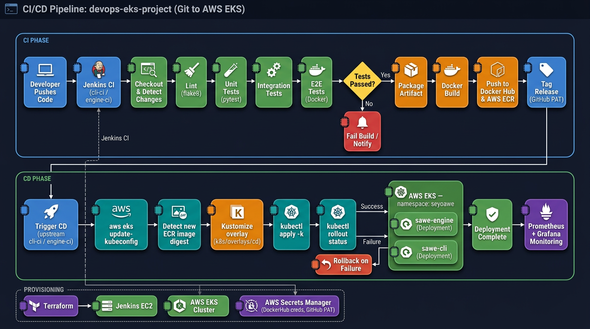

# DevOps EKS Project — SeyoAWE Platform

Full DevOps lifecycle around **SeyoAWE**, a modular workflow automation engine. This project delivers containerization, CI/CD pipelines (Jenkins), AWS infrastructure (Terraform + Ansible), Kubernetes deployment (EKS), and observability (Prometheus + Grafana).

**Current version:** `0.1.3` (see `VERSION`)
**ECR repositories:** `sawe-engine` · `sawe-cli`
**Docker Hub:** `<your-user>/sawe-engine` · `<your-user>/sawe-cli`
**App docs:** [`docs/seyoawe.md`](docs/seyoawe.md)

---

## Architecture



**CI phase** (`cli-ci`, `engine-ci`): Developer pushes code → Jenkins checks out → lint → unit / integration / E2E tests → Docker build → push to **Docker Hub + AWS ECR** → tag release on GitHub (via PAT from Secrets Manager).

**CD phase** (`cd`): Triggered on CI success → `aws eks update-kubeconfig` → detect new ECR image digest vs running pods → Kustomize overlay → `kubectl apply -k` → `kubectl rollout status` for `sawe-engine` (StatefulSet) and `sawe-cli` (Deployment) in namespace `seyoawe`. **Prometheus + Grafana** run in-cluster and scrape the workloads.

**Provisioning**: **Terraform** (Jenkins EC2 + EKS cluster + IAM) · **Ansible** (Jenkins container, Docker, AWS CLI, seed jobs) · **AWS Secrets Manager** (Docker Hub creds + GitHub PAT, read by Jenkins via EC2 instance profile — no Jenkins credentials UI).

---

## Repository Structure

```
devops-eks-project/
├── engine/              # SeyoAWE engine (binary + config + modules + tests)
├── cli/                 # sawectl CLI (Python) + tests
├── docker/              # Dockerfiles: engine, cli (+ *_test variants)
├── k8s/                 # Kubernetes manifests
│   ├── base/            # namespace, sawe-engine StatefulSet + Service, sawe-cli Deployment
│   └── overlays/cd/     # generated by Jenkins CD (image tags substituted)
├── terraform/
│   ├── jenkins-master/      # Jenkins EC2, IAM (ECR + EKS access), SG, EIP
│   └── devops-eks-cluster/  # VPC, EKS cluster, node groups, Prom/Grafana
├── ansible/
│   └── playbooks/configure-jenkins.yml   # Jenkins container, Docker, AWS CLI, plugins, seed jobs
├── jenkins/             # CI/CD pipeline definitions
│   ├── Jenkinsfile.cli
│   ├── Jenkinsfile.engine
│   └── Jenkinsfile.cd
├── monitoring/          # kube-prometheus-stack values
├── configure-env/       # .env template + export-env.sh (sync secrets to AWS)
├── docs/                # architecture + app documentation
├── run.sh               # run SeyoAWE engine locally (linux / macos)
└── VERSION
```

Each directory has its own `README.md` with detailed documentation.

---

## Quick Start

### 1. Environment Setup (one-time)

Required globally: **Python 3.10+**, **Docker**, **Terraform**, **Ansible**, **AWS CLI**, **kubectl**.

```bash
git clone <this-repo> devops-eks-project
cd devops-eks-project
cp configure-env/.env.example configure-env/.env
# edit .env: AWS_REGION, JENKINS_EIP, Docker Hub + GitHub PAT + Slack webhook
```

### 2. AWS Credentials (one-time)

```bash
aws configure
aws sts get-caller-identity
```

### 3. Sync Secrets to AWS Secrets Manager

```bash
./configure-env/export-env.sh   # pushes Docker Hub + GitHub PAT + Slack webhook
```

### 4. Provision Infrastructure

```bash
# Jenkins master (EC2 + IAM + SG + EIP)
cd terraform/jenkins-master
terraform init && terraform apply

# EKS cluster + Prometheus/Grafana (~15 min)
cd ../devops-eks-cluster
terraform init && terraform apply
cd ../..

# Configure kubectl
aws eks update-kubeconfig --name devops-eks-cluster --region us-east-1
```

### 5. Configure Jenkins

```bash
ansible-playbook -i ansible/inventory.sh ansible/playbooks/configure-jenkins.yml
```

Jenkins reachable at `http://$JENKINS_EIP:8080` with three seeded jobs: `cli-ci`, `engine-ci`, `cd`.

### 6. Start the App

On Jenkins: run `cli-ci` and `engine-ci` once — they build and push images, then `cd` deploys to EKS.

```bash
kubectl -n seyoawe get pods
# sawe-engine-0   1/1   Running
# sawe-cli-...    1/1   Running
```

Local dev alternative:

```bash
./run.sh macos   # or: ./run.sh linux
```

---

## Access Points

| Service        | Command                                                                            | URL                                                           |
| -------------- | ---------------------------------------------------------------------------------- | ------------------------------------------------------------- |
| **Engine API** | `kubectl port-forward svc/sawe-engine 8090:8080 -n seyoawe`                        | `POST http://localhost:8090/api/...`                          |
| **Grafana**    | `kubectl port-forward svc/monitoring-grafana 3000:80 -n monitoring`                | `http://localhost:3000` (see `monitoring/README.md` for creds) |
| **Prometheus** | `kubectl port-forward svc/monitoring-kube-prometheus-prometheus 9090:9090 -n monitoring` | `http://localhost:9090/targets`                         |
| **Jenkins**    | direct                                                                             | `http://$JENKINS_EIP:8080`                                    |
| **SSH Jenkins**| `ssh ec2-user@$JENKINS_EIP -i ~/.ssh/<your-key>.pem`                               | —                                                             |

---

## CI/CD Pipelines

Three Jenkins Declarative Pipelines. CI runs on GitHub push; CD runs downstream on CI success.

| Pipeline      | Trigger                                                 | Stages                                                                                                                   |
| ------------- | ------------------------------------------------------- | ------------------------------------------------------------------------------------------------------------------------ |
| **cli-ci**    | GitHub push (`cli/`, `docker/Dockerfile.cli`, `VERSION`)| Checkout → Detect Changes → Lint (flake8) → Unit + Integration + E2E tests → Docker Build → Push Docker Hub + ECR → Git Tag |
| **engine-ci** | GitHub push (`engine/`, `docker/Dockerfile.engine`, `VERSION`) | Checkout → Detect Changes → Lint → Tests → Docker Build → Push Docker Hub + ECR → Git Tag                               |
| **cd**        | Upstream success of `cli-ci` or `engine-ci` on `main`   | Kubeconfig → Detect new ECR digest vs running pods → Kustomize overlay → `kubectl apply -k` → `kubectl rollout status`   |

- **AWS auth** uses the Jenkins EC2 instance profile — no Jenkins-managed AWS credentials.
- **Docker Hub + GitHub PAT** are read from AWS Secrets Manager at runtime.
- **Slack** post-failure notifications via webhook stored in Secrets Manager.

---

## Documentation

| Document                  | Location                                            |
| ------------------------- | --------------------------------------------------- |
| CI/CD Architecture        | [`docs/cicd-architecture.md`](docs/cicd-architecture.md) |
| Architecture Diagram (PNG)| [`docs/assets/cicd-architecture.png`](docs/assets/cicd-architecture.png) |
| SeyoAWE App Guide         | [`docs/seyoawe.md`](docs/seyoawe.md)                |
| Jenkins Pipelines         | [`jenkins/README.md`](jenkins/README.md)            |
| Terraform (EKS)           | [`terraform/devops-eks-cluster/README.md`](terraform/devops-eks-cluster/README.md) |
| Ansible                   | [`ansible/README.md`](ansible/README.md)            |
| Docker Images             | [`docker/README.md`](docker/README.md)              |
| Monitoring                | [`monitoring/README.md`](monitoring/README.md)      |
| Environment Config        | [`configure-env/README.md`](configure-env/README.md) |

---

## License

Application content under `engine/` and `cli/` retains upstream **SeyoAWE** licensing (see [`LICENSE`](LICENSE)). This repository adds infrastructure and automation around that application.
