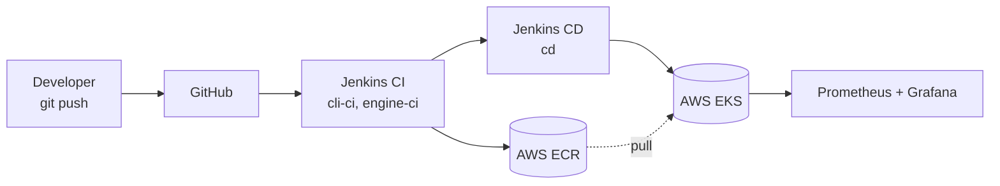
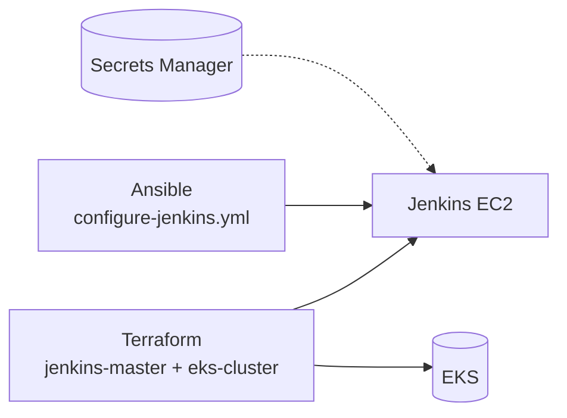

# CI/CD architecture — `devops-eks-project`

A minimal, presentation-ready view of **Git → Jenkins → AWS (ECR + EKS)**.

---

## One-slide diagram

---

## What each block does

| Block | Does | In the repo |
|-------|------|-------------|
| **Jenkins CI** | Test, build, push images | `jenkins/Jenkinsfile.cli`, `jenkins/Jenkinsfile.engine` |
| **ECR** | Private image registry for `sawe-cli`, `sawe-engine` | AWS account / region `us-east-1` |
| **Jenkins CD** | Check ECR vs cluster, `kubectl apply -k`, rollout | `jenkins/Jenkinsfile.cd` + `k8s/` |
| **EKS** | Runs `sawe-cli` (Deployment) and `sawe-engine` (StatefulSet) | `terraform/devops-eks-cluster/`, `k8s/base/` |
| **Monitoring** | Prometheus + Grafana (Helm) in-cluster | `monitoring/`, `terraform/devops-eks-cluster/` |

---

## Provisioning (run once / on changes)

- **Terraform**: EKS cluster, Jenkins EC2, IAM (EKS access entry + ECR for Jenkins).
- **Ansible**: installs Jenkins, Docker, AWS CLI, plugins, seeds jobs.
- **Secrets Manager**: Docker Hub + GitHub PAT, read by Jenkins via IAM (no Jenkins credentials UI).

Export `configure-env/.env` values with `configure-env/export-env.sh`.
